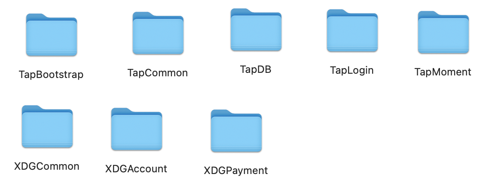

# XDGSDK-UE4

1.添加Plugins文件夹里的插件

2.配置Bootstrap数据

3.配置iOS数据
把 XDGCommon/Source/XDGCommon/iOS/iOSConfigs 文件夹里的 GoogleService-Info.plist 和 XDG-Info.plist 配置成自己的文件。

4.配置Android数据
把 XDGCommon/Source/XDGCommon/Android/assets 文件夹里的  XDG_info.json  
和 XDGAccount/Source/XDGAccount/Android/googleJson 文件夹里的 google-services.json 配置成自己的文件。

