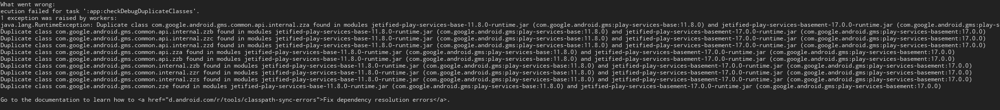
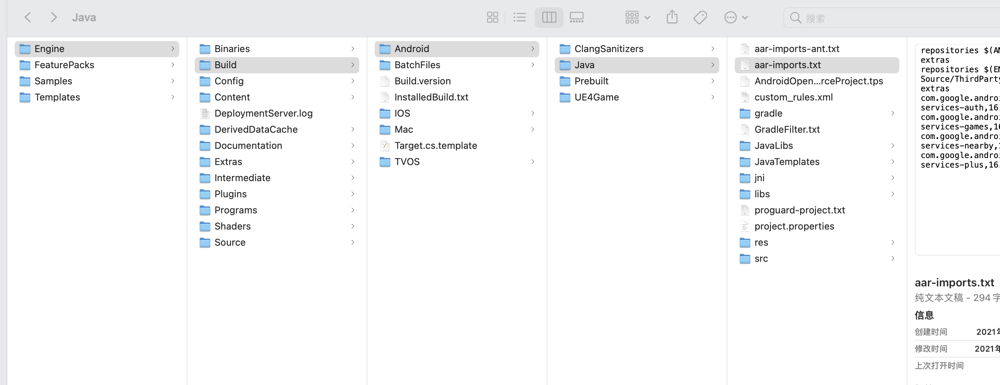
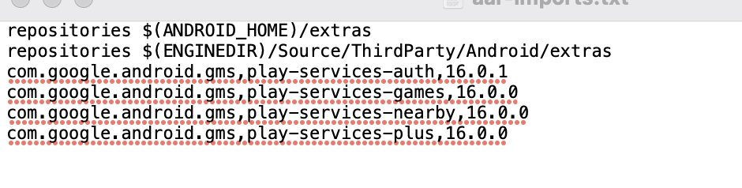

## XDGSDK-UE4配置

#### 1.添加Plugins文件夹里的插件


#### 2.配置iOS数据
把 `XDGCommon/Source/XDGCommon/iOS/iOSConfigs` 文件夹里的 `GoogleService-Info.plist` 和 `XDG-Info.plist` 配置成自己的文件。

把 `XDGCommon/Source/XDGCommon/XDGCommon_iOS_UPL.xml` 里的 `CFBundleURLSchemes`值配置成自己的参数。

#### 3.配置Android数据
把 `XDGCommon/Source/XDGCommon/Android/assets` 文件夹里的  `XDG_info.json`  
和 `XDGAccount/Source/XDGAccount/Android/googleJson` 文件夹里的 `google-services.json` 配置成自己的文件。

把`XDGCommon/Source/XDGCommon/XDGCommon_Android_UPL.xml` 中 `addElements`里的参数配置成自己的。

##### 4.1如果接入的时候有报谷歌gms包冲突的话，可以修改 `Engine/Build/Android/Java/aar-imports.txt`中对应的gms版本号。





## XDGCommon 使用

#### 1.使用接口在 `XDGCommon/Source/XDGCommon/Public/XDGCommonBPLibrary.h` 中

```
//初始化SDK
UFUNCTION(BlueprintCallable, Category = "XDGCommon")
static void InitSDK();

// 设置语言，int参数如下
// 0 简体中文
// 1 繁体中文
// 2 英文
// 3 泰文
// 4 印尼文
// 5 韩文
// 6 日文
// 7 德语
// 8 法语
// 9 葡萄牙语
// 10 西班牙语
// 11 土耳其语
// 12 俄语
UFUNCTION(BlueprintCallable, Category = "XDGCommon")
static void SetLanguage(int32 langType);

//获取版本号
UFUNCTION(BlueprintCallable, Category = "XDGCommon")
static FString GetSDKVersionName();

//是否初始化
UFUNCTION(BlueprintCallable, Category = "XDGCommon")
static bool IsInitialized();

//打开评分
UFUNCTION(BlueprintCallable, Category = "XDGCommon")
static void StoreReview();

//上报游戏信息
UFUNCTION(BlueprintCallable, Category = "XDGCommon")
static void Report(FString serverId, FString roleId, FString roleName);

//TapDB 统计用户，登录成功后使用
UFUNCTION(BlueprintCallable, Category = "XDGCommon")
static void TrackUser(FString userId);

UFUNCTION(BlueprintCallable, Category = "XDGCommon")
static void TrackRole(FString serverId, FString roleId, FString roleName, int32 level);

//自定义事件埋点
UFUNCTION(BlueprintCallable, Category = "XDGCommon")
static void TrackEvent(FString eventName);

//成就埋点
UFUNCTION(BlueprintCallable, Category = "XDGCommon")
static void TrackAchievement();

//完成新手引导埋点
UFUNCTION(BlueprintCallable, Category = "XDGCommon")
static void EventCompletedTutorial();

//穿件角色埋点
UFUNCTION(BlueprintCallable, Category = "XDGCommon")
static void EventCreateRole();

//分享文本
//type: 0Facebook   1Line  2Twitter
//uri: 连接
//message: 文本
UFUNCTION(BlueprintCallable, Category = "XDGCommon")
static void ShareFlavors(int32 type, FString uri, FString message);

//分享图片
//type: 0Facebook   1Line  2Twitter
//imagePath: 区分平台，iOS的沙盒图片路径  或者 安卓图片存储路径
UFUNCTION(BlueprintCallable, Category = "XDGCommon")
static void ShareImage(int32 type, FString imagePath);

//设置是否接收通知
UFUNCTION(BlueprintCallable, Category = "XDGCommon")
static void SetCurrentUserPushServiceEnable(bool enable);

//是否接收通知
UFUNCTION(BlueprintCallable, Category = "XDGCommon")
static bool IsCurrentUserPushServiceEnable();

//获取位置信息
UFUNCTION(BlueprintCallable, Category = "XDGCommon")
static void GetRegionInfo();

UFUNCTION(BlueprintCallable, Category = "XDGCommon")
static void EnableIDFA();  //设置启用IDFA， 初始化前调用

UFUNCTION(BlueprintCallable, Category = "XDGCommon")
static void RequestIDFA();  //请求IDFA弹框

```
#### 2.接口回调在 `XDGCommon/Source/XDGCommon/Public/XDGCommon.h` 中

```
//初始化回调
//success: true成功， false失败
UPROPERTY(BlueprintAssignable, Category = "XDGCommon")
static FXDGSDKInitSucceed OnXDGSDKInitSucceed;

//分享回调
//code: 0成功，1取消，2失败
UPROPERTY(BlueprintAssignable, Category = "XDGCommon")
static FXDGSDKShareCompleted OnXDGSDKShareCompleted;

//获取位置信息回调
//countryCode, city, timeZone, locationInfoType
UPROPERTY(BlueprintAssignable, Category = "XDGCommon")
static FXDGSDKGetRegionInfoCompleted OnXDGSDKGetRegionInfoCompleted;
```

#### 3. `XDGCommon`, `XDGAccount`, `XDGPayment` 的接口使用及回调可参考 `Source/Demo/DemoGameModeBase.h`  和 `Source/Demo/DemoGameModeBase.cpp`文件

`DemoGameModeBase.h`参考如下：
```
UCLASS()
class DEMO_API ADemoGameModeBase : public AGameModeBase
{
  GENERATED_BODY()
  virtual void BeginPlay() override;

  //XDGCommon
  void OnXDGSDKInitSucceed(const bool);

  //0成功，1取消，2失败
  void OnXDGSDKShareCompleted(const int32);

  void OnXDGSDKGetRegionInfoCompleted(const FString&, const FString&, const FString&, const FString&);

  //XDGAccount 
  void OnXDGSDKLoginSucceed(const FString&);

  void OnXDGSDKLoginFailed(const int32, const FString&);

  void OnXDGSDKGetUserSucceed(const FString&);

  void OnXDGSDKGetUserFailed(const int32, const FString&);

  void OnXDGSDKUserStateChanged(const int32, const FString&);

  void OnXDGSDKLoginSync(const FString&);

  //XDGPayment
  void OnXDGSDKPaymentSucceed(const FString&, const FString&, const FString&, const FString&);

  void OnXDGSDKPaymentFailed(const int32, const FString&);

  void OnXDGSDKQueryProductIdsSucceed(const FString&);

  void OnXDGSDKQueryProductIdsFailed(const int32, const FString&);

  void OnXDGSDKQueryRestoredPurchasesSucceed(const FString&);

  void OnXDGSDKQueryRestoredPurchasesFailed(const int32, const FString&);

  void OnXDGSDKPayWithWebCompleted(const FString&, const FString&, const int32, const FString&);

  void OnXDGSDKCheckRefundStatusSucceed(const FString&);

  void OnXDGSDKCheckRefundStatusFailed(const int32, const FString&);

};
```

`DemoGameModeBase.cpp`部分代码参考如下：
```
void ADemoGameModeBase::BeginPlay(){
    //XDGCommon
    FXDGCommonModule::OnXDGSDKInitSucceed.AddUObject(this, &ADemoGameModeBase::OnXDGSDKInitSucceed);
    FXDGCommonModule::OnXDGSDKShareCompleted.AddUObject(this, &ADemoGameModeBase::OnXDGSDKShareCompleted);
    FXDGCommonModule::OnXDGSDKGetRegionInfoCompleted.AddUObject(this, &ADemoGameModeBase::OnXDGSDKGetRegionInfoCompleted);

    //XDGAccount
    FXDGAccountModule::OnXDGSDKLoginSucceed.AddUObject(this, &ADemoGameModeBase::OnXDGSDKLoginSucceed);
    FXDGAccountModule::OnXDGSDKLoginFailed.AddUObject(this, &ADemoGameModeBase::OnXDGSDKLoginFailed);
    FXDGAccountModule::OnXDGSDKGetUserSucceed.AddUObject(this, &ADemoGameModeBase::OnXDGSDKGetUserSucceed);
    FXDGAccountModule::OnXDGSDKGetUserFailed.AddUObject(this, &ADemoGameModeBase::OnXDGSDKGetUserFailed);
    FXDGAccountModule::OnXDGSDKUserStateChanged.AddUObject(this, &ADemoGameModeBase::OnXDGSDKUserStateChanged);
    FXDGAccountModule::OnXDGSDKLoginSync.AddUObject(this, &ADemoGameModeBase::OnXDGSDKLoginSync);

    //XDGPayment
    FXDGPaymentModule::OnXDGSDKPaymentSucceed.AddUObject(this, &ADemoGameModeBase::OnXDGSDKPaymentSucceed);
    FXDGPaymentModule::OnXDGSDKPaymentFailed.AddUObject(this, &ADemoGameModeBase::OnXDGSDKPaymentFailed);
    FXDGPaymentModule::OnXDGSDKQueryProductIdsSucceed.AddUObject(this, &ADemoGameModeBase::OnXDGSDKQueryProductIdsSucceed);
    FXDGPaymentModule::OnXDGSDKQueryProductIdsFailed.AddUObject(this, &ADemoGameModeBase::OnXDGSDKQueryProductIdsFailed);
    FXDGPaymentModule::OnXDGSDKQueryRestoredPurchasesSucceed.AddUObject(this, &ADemoGameModeBase::OnXDGSDKQueryRestoredPurchasesSucceed);
    FXDGPaymentModule::OnXDGSDKQueryRestoredPurchasesFailed.AddUObject(this, &ADemoGameModeBase::OnXDGSDKQueryRestoredPurchasesFailed);
    FXDGPaymentModule::OnXDGSDKPayWithWebCompleted.AddUObject(this, &ADemoGameModeBase::OnXDGSDKPayWithWebCompleted);
    FXDGPaymentModule::OnXDGSDKCheckRefundStatusSucceed.AddUObject(this, &ADemoGameModeBase::OnXDGSDKCheckRefundStatusSucceed);
    FXDGPaymentModule::OnXDGSDKCheckRefundStatusFailed.AddUObject(this, &ADemoGameModeBase::OnXDGSDKCheckRefundStatusFailed);

    UE_LOG(LogTemp, Log, TEXT("playingsgm"));
}

//XDGCommon
void ADemoGameModeBase::OnXDGSDKInitSucceed(const bool success){
    UE_LOG(LogTemp, Log, TEXT("点击了 OnXDGSDKInitSucceed"));
    GEngine->AddOnScreenDebugMessage(-1, 5.f, FColor::Red, "OnXDGSDKInitSucceed: " + FString::FromInt(success));
}


void ADemoGameModeBase::OnXDGSDKShareCompleted(const int32 code){
    UE_LOG(LogTemp, Log, TEXT("点击了 OnXDGSDKShareCompleted"));
    GEngine->AddOnScreenDebugMessage(-1, 5.f, FColor::Red, "OnXDGSDKShareCompleted: " + FString::FromInt(code));
}
...

```

## XDGAccount 使用

#### 1.接口使用位于 `XDGAccount/Source/XDGAccount/Public/XDGAccountBPLibrary.h` 中

```
//单独调用第三方登录 
// "DEFAULT"  以上次登录成功的信息自动登录
// "TAPTAP"
// "GOOGLE"
// "FACEBOOK"
// "APPLE"
// "LINE"
// "TWITTER"
// "GUEST"
UFUNCTION(BlueprintCallable, Category = "XDGAccount")
static void LoginByType(FString loginType);

//SDK自带弹框弹框登录(不推荐)
UFUNCTION(BlueprintCallable, Category = "XDGAccount")
static void Login();

//绑定状态回调（登出，解绑等）
UFUNCTION(BlueprintCallable, Category = "XDGAccount")
static void AddUserStatusChangeCallback();

//获取用户
UFUNCTION(BlueprintCallable, Category = "XDGAccount")
static void GetUser();

//打开用户中心
UFUNCTION(BlueprintCallable, Category = "XDGAccount")
static void OpenUserCenter();

//退出
UFUNCTION(BlueprintCallable, Category = "XDGAccount")
static void Logout();

//获取sessionToken
UFUNCTION(BlueprintCallable, Category = "XDGAccount")
static void LoginSync();

//打开注销账号页面
UFUNCTION(BlueprintCallable, Category = "XDGAccount")
static void OpenAccountCancellation();

```

#### 2. 接口回调位于 `XDGAccount/Source/XDGAccount/Public/XDGAccount.h` 中

```
//登录成功
UPROPERTY(BlueprintAssignable, Category = "XDGAccount")
static FXDGSDKLoginSucceed OnXDGSDKLoginSucceed;

//登录失败
UPROPERTY(BlueprintAssignable, Category = "XDGAccount")
static FXDGSDKLoginFailed OnXDGSDKLoginFailed;

//获取用户成功
UPROPERTY(BlueprintAssignable, Category = "XDGAccount")
static FXDGSDKGetUserSucceed OnXDGSDKGetUserSucceed;

//获取用户失败
UPROPERTY(BlueprintAssignable, Category = "XDGAccount")
static FXDGSDKGetUserFailed OnXDGSDKGetUserFailed;

//用户状态回调
UPROPERTY(BlueprintAssignable, Category = "XDGAccount")
static FXDGSDKUserStateChanged OnXDGSDKUserStateChanged;

```

## XDGPayment 使用
## 由于支付模块iOS和安卓差别比较大，接口及回调数据需要区分平台分别接入！

接口使用位于 `XDGPayment/Source/XDGPayment/Public/XDGPaymentBPLibrary.h` 中

接口回调位于 `XDGPayment/Source/XDGPayment/Public/XDGPayment.h` 中

#### 1.接口使用

```
//苹果支付 或 谷歌支付 （苹果支付推荐使用）
UFUNCTION(BlueprintCallable, Category = "XDGPayment")
static void PayWithProduct(FString orderId,
                            FString productId,
                            FString roleId,
                            FString serverId,
                            FString ext);

//安卓网页支付（安卓支付这个推荐使用）
UFUNCTION(BlueprintCallable, Category = "XDGPayment")
static void PayWithWeb(FString serverId,
                        FString roleId,
                        FString productId, 
                        FString extras);

//检查补款信息(无弹框)
UFUNCTION(BlueprintCallable, Category = "XDGPayment")
static void CheckRefundStatus();

//检查补款信息(SDK自带弹框，会卡游戏使用流程)
UFUNCTION(BlueprintCallable, Category = "XDGPayment")
static void CheckRefundStatusWithUI();

//安卓渠道支付(根据配置用谷歌还是网页支付)
UFUNCTION(BlueprintCallable, Category = "XDGPayment")
static void PayWithChannel(FString orderId,
                            FString productId,
                            FString roleId,
                            FString serverId,
                            FString ext);
                            
//查询苹果或谷歌商品信息
UFUNCTION(BlueprintCallable, Category = "XDGPayment")
static void QueryWithProductIdArray(TArray<FString> productIds);
```

#### 2. 接口回调

```
//支付流程完成 (游戏成功以服务端通知为准，服务端需要对接接口)
UPROPERTY(BlueprintAssignable, Category = "XDGPayment")
static FXDGSDKPaymentSucceed OnXDGSDKPaymentSucceed;

//支付失败
UPROPERTY(BlueprintAssignable, Category = "XDGPayment")
static FXDGSDKPaymentFailed OnXDGSDKPaymentFailed;

//查询产品成功
//products数组json, 注意数组里ios和安卓的对象字段不一样的！
UPROPERTY(BlueprintAssignable, Category = "XDGPayment")
static FXDGSDKQueryProductIdsSucceed OnXDGSDKQueryProductIdsSucceed;

//查询产品失败
UPROPERTY(BlueprintAssignable, Category = "XDGPayment")
static FXDGSDKQueryProductIdsFailed OnXDGSDKQueryProductIdsFailed;

//transactions数组json, 注意数组里ios和安卓的对象字段不一样的！
UPROPERTY(BlueprintAssignable, Category = "XDGPayment")
static FXDGSDKQueryRestoredPurchasesSucceed OnXDGSDKQueryRestoredPurchasesSucceed;

UPROPERTY(BlueprintAssignable, Category = "XDGPayment")
static FXDGSDKQueryRestoredPurchasesFailed OnXDGSDKQueryRestoredPurchasesFailed;

//网页支付回调
//0完成，1取消，2处理中，其他失败
UPROPERTY(BlueprintAssignable, Category = "XDGPayment")
static FXDGSDKPayWithWebCompleted OnXDGSDKPayWithWebCompleted;

//检查补款成功
UPROPERTY(BlueprintAssignable, Category = "XDGPayment")
static FXDGSDKCheckRefundStatusSucceed OnXDGSDKCheckRefundStatusSucceed;

//检查补款失败
UPROPERTY(BlueprintAssignable, Category = "XDGPayment")
static FXDGSDKCheckRefundStatusFailed OnXDGSDKCheckRefundStatusFailed;
```


